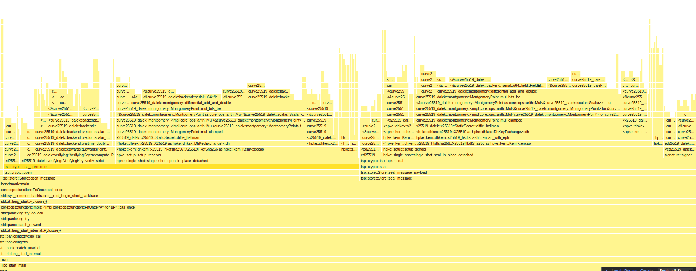

TSP SDK Performance metrics
===========================

To benchmark the TSP SDK on your machine, you can create a test executable. For the
benchmark results we list below, we use the following test executable:

```rust
use tsp::{OwnedVid, Store, VerifiedVid};

fn new_vid() -> OwnedVid {
    OwnedVid::new_did_peer("tcp://127.0.0.1:1337".parse().unwrap())
}

fn main() {
    let store = Store::new();
    let alice = new_vid();
    let bob = new_vid();

    store.add_private_vid(alice.clone()).unwrap();
    store.add_private_vid(bob.clone()).unwrap();

    let message = b"hello world";

    for _ in 0..1024 {
        let store = Store::new();
        store.add_private_vid(alice.clone()).unwrap();
        store.add_private_vid(bob.clone()).unwrap();

        let (url, sealed) = store
            .seal_message(alice.identifier(), bob.identifier(), None, message)
            .unwrap();

        assert_eq!(url.as_str(), "tcp://127.0.0.1:1337");

        let _ = store.open_message(&mut sealed.clone()).unwrap();
    }
}
```

This must be compiled with debug symbols in release mode. Add this to the `Cargo.toml`:

```toml
[profile.release]
debug = true
```

Now we can use the `samply` tool (`cargo install samply`) to see a flamegraph

```sh
cargo build --release
samply record -- target/release/benchmark # or whatever your binary is called
```



The flamegraph shows the call stack on the y axis, and relative time spent in a particular function on the x axis. We can see that the call stack starts at `start`, and eventually gets to our `benchmark::main` function.

We observe that all time is spent in dependencies, and this makes sense for the operations that be benchmark here. The `tsp` crate itself is just a thin wrapper around the dependencies, and does not introduce (significant) overhead.

---

in terms of throughput, we can do some rough math with this binary

```
> hyperfine target/release/benchmark
Benchmark #1: target/release/benchmark
  Time (mean ± σ):     359.0 ms ±   5.5 ms    [User: 358.0 ms, System: 0.9 ms]
  Range (min … max):   354.1 ms … 372.7 ms    10 runs
```

so, 1024 seals and opens (that based on the flamegraph take roughly equal time) takes 360ms. Per second that means `(1000 / 360) * 1024 = 2844` seals and opens, or roughly 5600 seals or opens per second.

Conclusions
-----------
The TSP SDK is mostly performance limited by two factors

- Operations that interact with the network (that might cause unpredictable latency, etc.)
- The raw speed of the cryptographic primitives, in particular the "large number" multiplications that happen deep inside a Curve25519 implementation.
