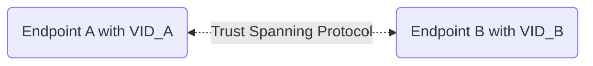
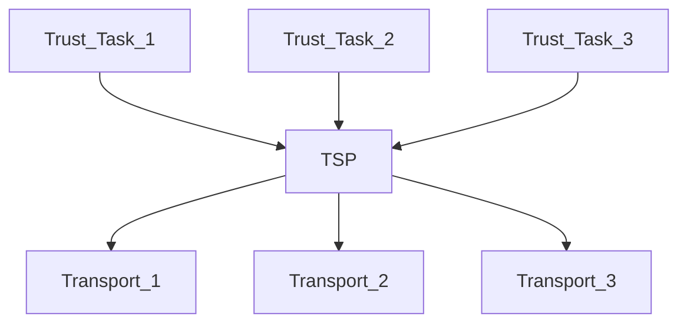
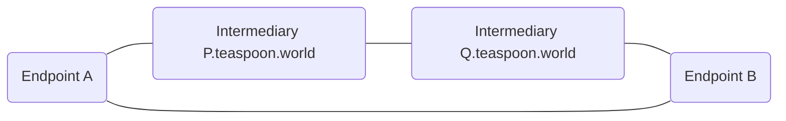

# TSP SDK Design Overview

## Introduction to TSP

TSP (Trust Spanning Protocol) is an interoperability layer protocol for two communicating endpoints to establish and maintain a trust relationship. TSP enables endpoints to cryptographically verify each other's identifiers. Such identifiers are therefore called *Verifiable Identifiers* (VID). There can be many verifiable identifiers including many legacy identifiers in common use today but also newly designed identifiers for strong verifiability. It is up to the applications to decide and choose what identifiers are considered sufficiently verifiable.

As an interoperability protocol, we try to minimize the features in TSP to those that are essential for an effective trust relationship over an untrusted network environment, such as the public Internet, and leave other functions to be implemented in a higher layer. The features included in TSP are:

- Authenticity: From whom the message is sent and to whom (only). The message has not been tampered.
- Confidentiality: Except for the sender, only the identified receiver can read the message.
- Meta-data privacy: TSP also offers context privacy protection (e.g. Internet meta-data) mechanisms, including protections through untrusted intermediaries.

TSP chooses a common three layer approach similar to the Internet. The three layers are, from bottom to top, the transport layer, the spanning layer, and the trust task layer.

The above diagram explains why it is called the Trust Spanning Protocol. By adopting a common TSP layer, applications or *trust tasks* of different implementations or designs may approach interoperability while maintaining trust.

## Modules

The TSP SDK has several goals: we want to provide a good implementation of TSP in Rust that can be used in a lower level as a communication protocol and in a higher level that also includes its wallet and local states; we want language bindings to languages commonly needed in the applications; we want to provide some of common VIDs, transports, and trust tasks; we also want to implement a useful testbed for developers.

Here is a list of main software modules:
- A TSP SDK implemented in Rust as the core module, including TSP the communication protocol and the necessary wallet and local states.
- A subset of the above for application who only wants an implementation TSP the communication protocol.
- Various language bindings of the TSP SDK: Python, Javascript, Node.js
- A selection of supported VIDs: `did:peer`, `did:web`, `did:webvh`
- A selection of supported transports: HTTP (with WebSockets), TLS, QUIC, TCP
- A CLI for testing endpoints
- A cloud based testbed hosted at `teaspoon.world`.

The SDK of course provides convenient ways that any developer can add additional VID types, transport mechanisms, language bindings, and most importantly trust tasks or applications.

## A Testbed

The following diagram illustrates the layout of nodes simulated in the testbed. It is designed to make most, but not all of course, of common tests easier for developers. It is used by all unit and regression tests by developers.

As shown above, the two endpoints `A` and `B` can communicate through TSP directly or through the intermediaries. Not shown in the diagram (for simplicity) is the case where there is only one intermediary between them.

Also, not shown but provided by the testbed is a *Support System* `did.teaspoon.world` for VID verification, and an *Out Of Band* discovery site `www.teaspoon.world`.

The endpoints may be simulated in the [testbed](https://demo.teaspoon.world), but a more useful way is to run endpoints locally using the provided CLI.

The testbed is provided for contributing developers only. Please contact project maintainers in the Discord channel for access. The testbed is limited in its capacity of course and is not reliable for anything other than testing.

