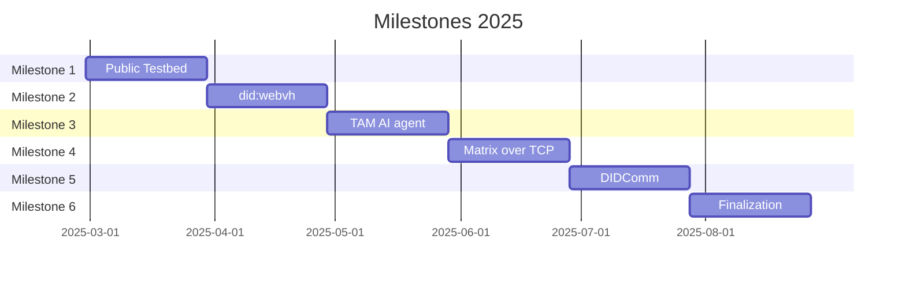
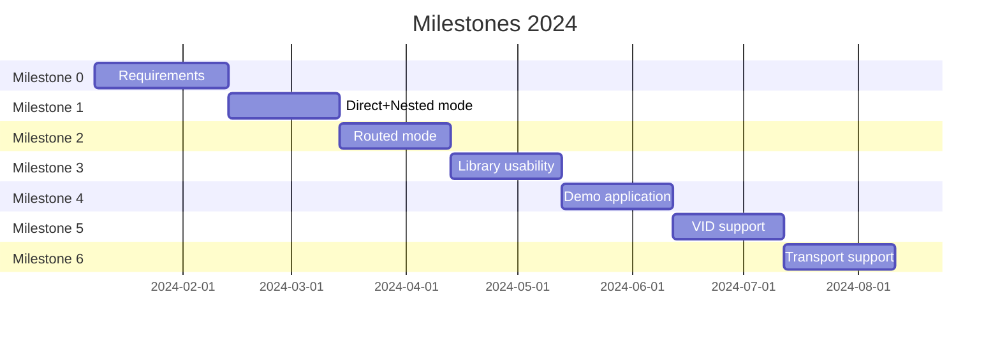

# Second Six Milestones, Teaspoon Project (2025)

# First Six Milestones (2024)

Updates to the planning: since `libsodium` could not be used (since its Rust wrapper,
`sodiumoxide`, is deprecated), and we find it necessary to write our own CESR report, these tasks have to be explicitly
added to the planning. For the cryptography selection, that work has already been done in M0.

The CESR implementation will be explicitly added to M1. This will take the place of "a few demo cases", which will be
moved to the next milestone after that (M2)

For the latter two milestones (which in the SOW were left rather open as "Meet Additional Requirements"), these have
been tentatively taken up by areas that we expect will be important at that time, namely more support for handling
various types of VID's and Transport Layer support.

M0:

* A functional requirements & high-level design document, including very strong security requirements, that clarifies
  details and dependencies of the protocol implementation (e.g., Rust development environment, testbed, encoding,
  cryptographic libs, GitHub, and other dependencies).
* Update the estimate and plan as necessary.
* Create GitHub repos and CI configuration.

M1:

* Implementation of TSP Direct Mode as documented in the draft spec Sections 2, 3, 4, 5, with references to others.
  Set up a testing framework.
* Implement the (subset of) CESR encoding/decoding necessary for at least direct mode.
* Implementation of basic SDK and simple README docs.
* Make the GitHub repo public. Enable and support external software reviews and bug reports/fixes in the open-source repos.

M2:

* Implementation of Routed Mode as documented in the draft spec Section 7, Multi-Recipient in Section 8, with
  references to other sections in the spec.
* Implement some demo cases / examples
* Enhance the testing framework, docs, etc. to support Routed Mode.

M3:

* Usable, documented, and tested protocol library ready for external software developers to use.
* Ready for accepting open source contributions with documented SDK interfaces. Establish necessary security policy,
  community standards, etc.
* Conduct performance benchmarks.
* Fix critical-level bugs.

M4:

* Develop a real-life example application (for example, a chat application but may depend on community inputs).
* Security analysis by external party. Technical report on privacy and security properties of the implementation.
* Fix critical & high-priority level bugs.

M5:

* Add more support for specific types of VID. Even though this is originally out-of-scope, this is an important part
  of the overall TSP infrastructure. We could work together with an external party for this.
* Expose rust-tsp in another programming language.

M6:

* We expect that TSP will need various alternative transport layers (Quic, HTTPS, E-Mail, etc.), due to its
  transport-agnostic nature.
* Add rust-tsp support to additional languages.
